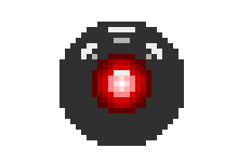

<p align="center">
  <br>
  <strong>zee</strong><br><br>
  Push-to-talk voice transcription.<br>
  Pure Go. No dependencies. Sub-second fast.<br><br>
  
  
  <a href="https://freepalestine.dev"></a>
</p>

## Highlights

- **Fast** — obsessively optimized end-to-end. HTTP keep-alive, TLS connection reuse, pre-warmed connections, streaming encoder runs during recording (not after). Typical latency from key-release to clipboard: under 500ms.
- **Pure Go encoding** — no CGO for encoding or TUI. MP3 and FLAC encoders, all pure Go.
- **Cross-platform** — minimal dependencies, pure Go where possible. Designed to run anywhere Go compiles.
  - [x] macOS
  - [ ] Linux
  - [ ] Windows
- **Multiple providers** — Groq Whisper and DeepGram, switchable at runtime.
- **Encoding modes** — `fast` (MP3 16kbps), `balanced` (MP3 64kbps), `precise` (FLAC lossless).
- **[HAL 9000](https://en.wikipedia.org/wiki/HAL_9000) TUI** — voice-reactive animated eye with real-time transcription metrics. 
  - Terminal-based for now, windowed UI planned.

## Usage

Hold `Ctrl+Shift+Space` to record, release to transcribe. Result goes to clipboard and auto-pastes.

```bash
make build
export GROQ_API_KEY=your_key
./zee
```

Use `-setup` to pick a microphone, otherwise uses system default.

### macOS Permissions

On first run, macOS will prompt you to grant permissions to your terminal app (Ghostty, iTerm2, Terminal.app, etc.):

1. **Microphone** — Required for audio recording. Go to System Settings → Privacy & Security → Microphone and enable your terminal.

2. **Accessibility** — Required for global hotkey and auto-paste. Go to System Settings → Privacy & Security → Accessibility and enable your terminal.

If permissions aren't granted, zee will fail silently or the hotkey won't register. Run with `-doctor` to diagnose permission issues.

## Testing

```bash
make test                                      # unit tests
make integration-test WAV=test/data/short.wav  # requires GROQ_API_KEY
make benchmark WAV=file.wav RUNS=5             # multiple runs for timing
```

## Flags

| Flag | Default | Description |
|------|---------|-------------|
| `-mode` | fast | Transcription mode: `fast`, `balanced`, `precise` |
| `-setup` | false | Select microphone device |
| `-autopaste` | true | Auto-paste after transcription |
| `-lang` | (auto) | Language code for transcription (e.g., `en`, `es`, `fr`) |
| `-expert` | false | Show full TUI with HAL eye animation |
| `-doctor` | false | Run system diagnostics and exit |
| `-saverecording` | false | Save last recording to `zee_last.<format>` |
| `-logpath` | OS-specific | Log directory path (use `./` for current dir) |
| `-profile` | - | Enable pprof server (e.g., `:6060`) |
| `-benchmark` | - | WAV file for benchmarking |
| `-runs` | 3 | Benchmark iterations |
| `-version` | false | Print version and exit |

## About

Vibe-coded in ~30 hours with AI, but built with love and care. The kind of polish you get when you actually use the thing you're building.
