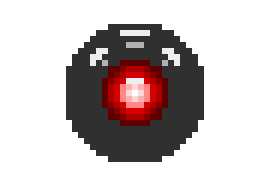

<p align="center">
  <br>
  <strong>zee</strong><br><br>
  Voice transcription that stays out of your way.<br>
  Supports Groq, OpenAI, and Deepgram models.<br>
  Push-to-talk, tap-to-toggle, or real-time streaming. Pure Go. Sub-second fast.<br><br>
  
  
  <a href="https://freepalestine.dev"></a>
</p>

<p align="center">
  
</p>

## Highlights

- **System tray app** — lives in the menu bar. Switch microphones, transcription providers, and languages from the tray menu. Dynamic icons show recording and warning states.
- **Three recording modes** — push-to-talk (hold hotkey), tap-to-toggle (tap to start/stop), or hybrid (both on the same key via `-hybrid`).
- **Real-time streaming** — with `-stream`, words appear as you speak and auto-paste into the focused window incrementally. Powered by Deepgram's WebSocket API.
- **Fast batch mode** — HTTP keep-alive, TLS connection reuse, pre-warmed connections, streaming encoder runs during recording (not after). Typical key-release to clipboard: under 500ms.
- **Auto-paste** — transcribed text goes straight to clipboard and pastes into the active window. In streaming mode, each new phrase pastes as it arrives.
- **Silence detection** — VAD-based voice activity detection warns when no speech is heard. In streaming mode, auto-closes recording after 30 seconds of silence.
- **Pure Go encoding** — MP3 and FLAC encoders, no CGO. Three formats: `mp3@16` (smallest), `mp3@64` (balanced), `flac` (lossless).
- **Multiple providers** — Groq, OpenAI, and Deepgram, switchable from the tray menu at runtime.
- **36 languages** — select transcription language from the tray menu or via `-lang` flag.
- **Cross-platform** — minimal dependencies, pure Go where possible.
  - [x] macOS
  - [ ] Linux
  - [ ] Windows

## Install

### Homebrew (recommended)

```bash
brew install --cask sumerc/tap/zee
```

Installs `Zee.app` to `/Applications`. Launch from Spotlight or the Applications folder.

### macOS (DMG)

1. Download `Zee-<version>.dmg` from the [latest release](https://github.com/sumerc/zee/releases/latest)
2. Open the DMG and drag **Zee.app** to **Applications**

### CLI binary

For terminal usage, install the formula or download directly:

```bash
brew install sumerc/tap/zee         # installs to /opt/homebrew/bin/zee
```

```bash
# or download manually — Apple Silicon
curl -L https://github.com/sumerc/zee/releases/latest/download/zee_darwin_arm64.tar.gz | tar xz

# Intel
curl -L https://github.com/sumerc/zee/releases/latest/download/zee_darwin_amd64.tar.gz | tar xz
```

```bash
GROQ_API_KEY=xxx zee                # Groq Whisper
OPENAI_API_KEY=xxx zee -stream      # Deepgram streaming
zee -debug                          # with diagnostic logging
```

> **Note:** When running from a terminal, macOS permissions (Microphone, Accessibility) are granted to the **terminal app** (e.g. Ghostty, iTerm2, Terminal), not to zee itself.

### Build from source

```bash
git clone https://github.com/sumerc/zee && cd zee
make build        # CLI binary
make app          # macOS DMG
```

## Usage

```bash
export GROQ_API_KEY=your_key    # batch mode (Groq Whisper)
zee                              # starts in menu bar, hold Ctrl+Shift+Space to record
```

```bash
export DEEPGRAM_API_KEY=your_key # streaming mode (Deepgram)
zee -stream                      # words appear as you speak
```

zee runs as a system tray app in the menu bar. Hold `Ctrl+Shift+Space` to record, release to transcribe. Result auto-pastes into the focused window.

With `-hybrid`, a short tap toggles recording on/off (hands-free) while a long press works as push-to-talk.

Use the tray menu to switch microphones, providers, and languages — or use `-setup` for initial device selection.

### macOS Permissions

On first run, macOS will prompt for permissions:

1. **Microphone** — Required for audio recording. System Settings → Privacy & Security → Microphone.

2. **Accessibility** — Required for global hotkey and auto-paste. System Settings → Privacy & Security → Accessibility.

If permissions aren't granted, zee will fail silently or the hotkey won't register. Run with `-doctor` to diagnose permission issues.

## Testing

```bash
make test                                      # unit tests
make test-integration                          # integration tests (builds binary, requires GROQ_API_KEY)
make integration-test WAV=test/data/short.wav  # single-file integration test (requires GROQ_API_KEY)
make benchmark WAV=file.wav RUNS=5             # multiple runs for timing
```

## Flags

| Flag | Default | Description |
|------|---------|-------------|
| `-stream` | false | Real-time streaming transcription (Deepgram) |
| `-format` | mp3@16 | Audio format: `mp3@16`, `mp3@64`, or `flac` |
| `-hybrid` | true | Tap-to-toggle + hold-to-talk on the same hotkey |
| `-longpress` | 350ms | Threshold distinguishing tap vs hold |
| `-autopaste` | true | Auto-paste into focused window |
| `-setup` | false | Select microphone device |
| `-device` | (default) | Use named microphone device |
| `-lang` | en | Language code (e.g., `en`, `es`, `fr`) |
| `-debug` | false | Enable diagnostic logging |
| `-debug-transcribe` | false | Enable transcription text logging (requires `-debug`) |
| `-doctor` | false | Run system diagnostics and exit |
| `-logpath` | OS-specific | Log directory (use `./` for current dir) |
| `-profile` | - | pprof server address (e.g., `:6060`) |
| `-benchmark` | - | WAV file for benchmarking |
| `-runs` | 3 | Benchmark iterations |
| `-version` | false | Print version and exit |

## About

Started as a vibe-coding project but turned into a standalone app I use daily for all my speech-to-text. Built with AI, love, and care — the kind of polish you get when you actually use the thing you're building.
