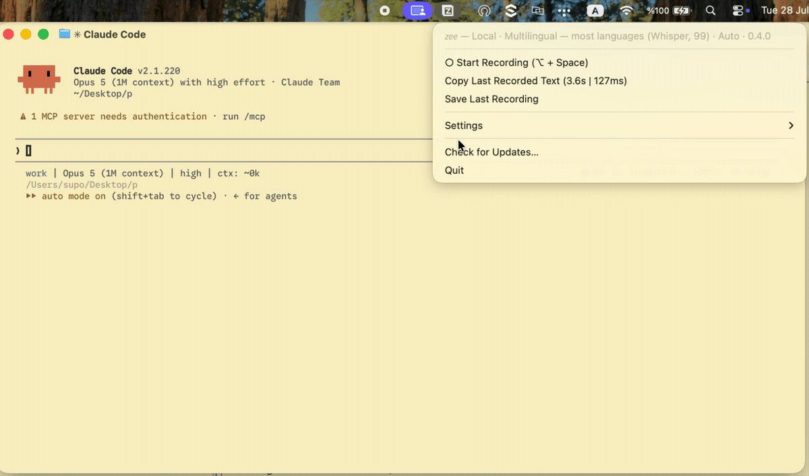

<p align="center">
  <br>
  <strong>zee</strong><br><br>
  Voice transcription that stays out of your way.<br>
  <strong>Runs fully on-device — no account, no API key, no network.</strong><br>
  Local Parakeet and Whisper on Metal, or Groq, OpenAI, Mistral, ElevenLabs and Deepgram.<br>
  Push-to-talk, tap-to-toggle, or real-time streaming. Pure Go. Sub-second fast.<br><br>
  <a href="https://github.com/sumerc/zee/actions/workflows/ci.yml"></a>
  <a href="https://github.com/sumerc/zee/releases/latest"></a>
  
  
  <a href="LICENSE"></a>
  <a href="https://freepalestine.dev"></a>
</p>

<p align="center">
  
</p>

## Highlights

- **Offline, on-device** — fully local on Apple Silicon, **no API key, no network**, from the first launch. Two Metal-accelerated engines: **Parakeet** for fast English, **Whisper** large-v3 turbo for **~99** languages with auto-detect.
- **Two recording modes** — hold the hotkey to talk, or tap once to start and again to stop.
- **Real-time streaming** — with a streaming model (Deepgram Nova-3), words appear and paste as you speak.
- **Sub-second fast** — under **~500 ms** from key release to clipboard, for most models, cloud ones included.
- **Auto-paste** — the transcript pastes into the focused window.
- **Silence detection** — VAD warns when nothing is heard.
- **Providers, switchable at runtime** — local Parakeet and Whisper, plus Groq, OpenAI, Mistral, ElevenLabs and Deepgram, all from the menu bar.
- **Cross-platform** — minimal dependencies, pure Go where possible.
  - [x] macOS (Apple Silicon)
  - [ ] Linux — planned
  - [ ] Windows — planned

## Install

```bash
curl -fsSL https://raw.githubusercontent.com/sumerc/zee/main/install.sh | bash
```

Downloads the local models once, then runs the setup wizard, which asks for
Microphone and Accessibility. Grant both and you're done.

## Use

Hold your configured hotkey to record, release to transcribe. The text lands in
your clipboard and pastes into whatever window you're in.

Microphone, provider, language, and hotkey all live in the tray menu. To add a
cloud provider (Groq, OpenAI, Deepgram, Mistral, ElevenLabs), run `zee setup` —
it live-tests the key as you paste it.

## Update

Quit zee from the menu bar, then:

```bash
/Applications/Zee.app/Contents/MacOS/zee update
```

The tray's **Check for Updates** tells you when a release is out; this command is
what installs it.

## Docs

- [**Reference**](docs/reference.md) — flags, environment variables, config and log
  file layout, CLI install, building from source, testing and benchmarks.
- [**Design notes**](docs/design-notes.md) — *why* the non-obvious choices were
  made: which engine and model, which backend, what got measured, and which
  alternatives were tried and rejected. Worth reading before changing anything in
  `audio/`, `transcriber/`, or the local model registry.

## About

Started as a vibe-coding project but turned into a standalone app I use daily for all my speech-to-text. Built with AI, ❤️, and care — the kind of polish you get when you actually use the thing you're building.
